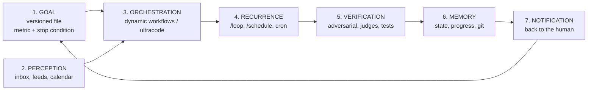

# Turning Claude Code into an Autonomous Production Machine

**Dynamic workflows, loops and goals: what is verified, what is folklore, and how to actually build the machine.**

*Version 1.1, June 5, 2026. Method: a multi-agent deep research run (26 sources, 125 claims extracted, 25 adversarially verified with 3 independent verifier votes each, 23 confirmed, 2 refuted), completed by a direct reading of the official docs and blogs on June 5, and by early-adopter practitioner reports. Dynamic workflows are a research preview: names, caps and keywords may change quickly.*

---

## TL;DR

1. **Dynamic workflows are real and official**: since May 28, 2026, Claude Code can write its own orchestration harness on the fly (a JavaScript script) that drives tens to hundreds of subagents in the background, with adversarial verification before anything reaches you.
2. **ultracode is not a tool, it is a mode**: a setting in the `/effort` menu that combines maximum reasoning (xhigh) with automatic workflow triggering on every substantive task.
3. **Boris Cherny (creator of Claude Code) is pushing a coherent autonomy story**: auto mode to remove permission babysitting, multi-clauding (5 to 10 parallel instances), `/loop` and `/schedule` for recurrence.
4. **`/goal` is a ghost command.** A single sentence in the official launch blog, zero documentation, invisible in the builds we could observe. Viral roadmaps teaching it as an established building block are overselling. But the goal concept remains the keystone: today it is built as a file, and this guide shows how.
5. **The unsolved problem**: no verified pattern knows how to loop on content whose quality cannot be checked mechanically (a text, a visual, a dossier). That is the real frontier, and section 8 proposes a pragmatic approach.

---

## 1. What just happened

On May 28, 2026, Anthropic released **Claude Opus 4.8** and, the same day, Claude Code **dynamic workflows** as a research preview ([official announcement](https://claude.com/blog/introducing-dynamic-workflows-in-claude-code), [Opus 4.8 page](https://www.anthropic.com/news/claude-opus-4-8)). Availability: CLI, Desktop and the VS Code extension, on all paid plans (Pro via `/config`, Max/Team by default, Enterprise via admin), plus the Claude API, Amazon Bedrock, Vertex AI and Microsoft Foundry. Requires Claude Code v2.1.154 or later.

On June 2, a second official post provided the conceptual framing that set the networks on fire: ["A harness for every task"](https://claude.com/blog/a-harness-for-every-task-dynamic-workflows-in-claude-code). The central idea, quoted from the post: *"Claude can now write its own harness on the fly, custom-built for the task at hand."*

That is the sentence currently circulating everywhere, often distorted. Here is what it actually means.

## 2. Dynamic workflows: Claude writes its own harness

A **harness**, in agent jargon, is the software structure around the model: what decides what to launch, in what order, how to verify, when to stop. Until now, the harness was fixed (Claude Code's own) or hand-written by developers. The new thing: Claude writes a disposable harness itself, custom-built for your task.

Concretely, a dynamic workflow is ([official docs](https://code.claude.com/docs/en/workflows)):

- **A JavaScript script** that Claude writes for the task you describe, executed by a runtime **in the background, in an isolated environment**, while your session stays responsive.
- The script orchestrates subagents with a few special functions: `agent()` spawns a subagent, `parallel()` runs tasks concurrently (with a barrier: it waits for everyone), `pipeline()` pushes items through successive stages with no barrier (each item moves at its own pace).
- **Intermediate results live in script variables, not in Claude's context window.** This is the decisive architectural point: the machine can churn through massive volumes without saturating its own context.
- The script can route each agent to a different model (Opus for hard reasoning, Haiku for cheap exploration), and isolate each agent in its own git worktree.
- Every run writes its script to a file in your session: you can read it, diff it against a previous run, edit it and relaunch. An interrupted run is resumable in the same session, with already-completed agents returning cached results.

### Who holds the plan: the real difference from subagents and skills

The official docs' comparison table is the best compass for choosing your tool:

| | Subagents | Skills | Agent teams | **Workflows** |
|---|---|---|---|---|
| Who decides what runs next | Claude, turn by turn | Claude, following the prompt | The lead agent | **The script** |
| Where intermediate results live | Context window | Context window | Shared task list | **Script variables** |
| Scale | A few tasks per turn | Same | A handful of long-running peers | **Dozens to hundreds of agents per run** |

The docs' formula: *"A workflow moves the plan into code."* The plan leaves Claude's head and enters deterministic code. That is what makes the orchestration reliable AND replayable.

### The three failure modes workflows fix

The launch post explicitly names the three pathologies of long single-context work:

1. **Agentic laziness**: Claude stops before finishing a complex, multi-part task and declares the job done after partial progress (20 of 50 items addressed, the rest "handled").
2. **Self-preferential bias**: Claude prefers its own results when asked to verify or judge them. A verifier with skin in the game cannot be an honest verifier.
3. **Goal drift**: the gradual loss of fidelity to the original objective across many turns, especially after compaction. "Don't do X" constraints quietly evaporate at turn 47.

A workflow fixes all three structurally: separate Claudes, isolated contexts, focused goals, and a deterministic program guaranteeing every item on the list gets handled. If your task suffers from any of these three symptoms, that is the signal to reach for a workflow.

### The real scale (and the nuance marketing omits)

Marketing says "hundreds of subagents in parallel". The docs say precisely: dozens to hundreds of agents **per run**, with a cap of **16 concurrent agents** (fewer on machines with limited CPU cores) and **1,000 agents total per run**. "Hundreds in parallel" therefore describes a run's total, not actual instantaneous parallelism. Two more structuring limits: no user input mid-run (for sign-off between stages, split into several workflows), and the script itself has no direct filesystem or shell access; the agents do the reading, writing and executing.

### Built-in adversarial verification

Before the result reaches you, **independent agents adversarially review each other's findings** ("independent agents adversarially review each other's findings before they're reported", official docs). This is the mechanism that answers self-preferential bias: a single agent re-reading itself confirms its own errors. Several agents paid to refute each other is structurally more reliable.

### The six official patterns

The launch post names six orchestration shapes. The reading grid: identify which failure mode your task suffers from, then pick the pattern that structurally prevents it.

| Pattern | Principle | When |
|---|---|---|
| **Classify-and-act** | A classifier decides the task type, then routes to the right agents and model | Heterogeneous work, spend Opus only where it is hard |
| **Fan-out-and-synthesize** | Split into N items, one agent per item in parallel, then merge | Enumerable list of independent items (50 files, 200 sources) |
| **Adversarial verification** | For each producer agent, a separate verifier agent that does not know who produced the artifact | Factual claims, review, quality gates |
| **Generate-and-filter** | Generate many options, then filter by rubric and dedupe | Brainstorming, naming, hypothesis design |
| **Tournament** | N agents attempt the same task, pairwise judging until one wins | Taste-based ranking, sorting large volumes (comparative judgment beats absolute scoring) |
| **Loop until done** | Keep spawning agents until a stop condition is met | Unknown amount of work (bug hunting, pattern mining) |

Real workflows compose 2 to 4 of them: deep research, for instance, is fan-out (parallel searches) + adversarial verification (each claim independently checked) + cited synthesis.

### How you invoke one, how you keep it

In natural language ("create a workflow that...", "use a workflow"), via the `ultracode` keyword (see section 3), or via an existing workflow command. Claude Code ships one bundled workflow: **`/deep-research <question>`**, which fans out web searches, cross-checks sources, votes on each claim and returns a cited report with non-surviving claims already filtered out.

Runs are managed via `/workflows`: see phases, agent counts, tokens per agent, pause (`p`), stop (`x`), restart an agent (`r`). And above all **save (`s`)**: the run's script becomes a reusable `/<name>` command, stored in `.claude/workflows/` (project, shared via the repo) or `~/.claude/workflows/` (personal, all projects). A saved workflow accepts arguments (`args`): you can pass it a question, a list of paths, a config object. Early adopters go further and bundle the workflow's JavaScript file **inside a skill**, referenced from SKILL.md, prompting Claude to treat it as an adaptable template rather than a script to run verbatim.

This is the link that turns the feature into a machine: an improvised workflow is a demo, a saved and versioned workflow is a production asset.

## 3. ultracode: not a tool, a mode

This is the most widespread confusion right now, so let's clarify with primary sources:

| | Dynamic workflow | ultracode |
|---|---|---|
| Nature | The orchestration tool (the JS script + its runtime) | A Claude Code **setting** |
| Where | Triggered on demand | The `/effort` menu |
| Effect | Executes ONE orchestration | Sets reasoning effort to xhigh AND lets Claude decide on its own to launch workflows, for every substantive task in the session |

Quoting the docs: *"Ultracode is a Claude Code setting that combines xhigh reasoning effort with automatic workflow orchestration. With it on, Claude plans a workflow for each substantive task instead of waiting for you to ask."*

The details that matter in practice:

- The keyword `ultracode` in a prompt triggers a **one-off** workflow without changing the session mode. Claude Code highlights the keyword in your input; `Option+W` (macOS) dismisses it for that prompt, and a `/config` toggle disables it entirely.
- `/effort ultracode` lasts for the current session and resets on the next one. A single request can chain several workflows: one to understand, one to change, one to verify. Token consumption scales accordingly.
- The mode only exists on models that support xhigh effort; elsewhere it does not appear in the menu.
- A telling detail about how young this feature is: before v2.1.160, the trigger keyword was literally `workflow` (since renamed).

So: the workflow is the engine, ultracode is the governor that decides when the engine starts by itself.

## 4. What Boris Cherny actually says

Boris Cherny created Claude Code at Anthropic. His public statements since March 2026 are the most quoted (and most paraphrased) source of the moment. The verified facts:

**On babysitting** (X post, April 16, 2026): *"Auto mode = no more permission prompts."* He describes auto mode as the safer alternative to `--dangerously-skip-permissions` for long autonomous tasks: deep research, refactoring, building features, iterating until a benchmark is hit. The Anthropic engineering post of March 25, 2026 ("How we built Claude Code auto mode") confirms it: auto mode is *"a middle ground between manual review and no guardrails"*, meant to replace the dangerous flag. Mind the official caveat: auto mode *"reduces prompts but does not guarantee safety"*. It is a research preview, not a guarantee.

**On parallelism** (same thread): *"This means no more babysitting while the model runs. More than that, it means you can run more Claudes in parallel. Once a Claude is cooking, you can switch focus to the next Claude."* Trade press reports he runs 5 to 10 instances on a normal day. This is the pattern the community calls multi-clauding (the term is not Cherny's).

**On recurrence** (X post, March 29, 2026): *"Two of the most powerful features in Claude Code: /loop and /schedule."* `/loop` takes an interval and a slash command and re-runs it (format `\d+[smhd]`, default 10 minutes). His personal examples: `/loop 5m /babysit`, `/loop 30m /slack-feedback`, `/loop 1h /pr-pruner`. Important: those three are **his custom skills**, not built-in commands. `/loop` tasks automatically expire after 7 days. `/schedule` is backed by Routines (shipped April 14, 2026) for durable tasks.

Be wary, on the other hand, of unsourced quotes in circulation: the "I don't prompt Claude anymore. I write loops. My job is to write loops" plastered across viral threads is an unsourced paraphrase of his /loop tweet, not a verified quote. The idea is faithful; the words are not his.

Cherny's overall logic fits in one sentence: remove the interruptions (auto mode), so you can parallelize (multi-clauding), and schedule the recurrence (/loop, /schedule). Less babysitting, more throughput.

## 5. Loops: from the Ralph loop to the official /loop

Before the official features, the community invented its own loops. The most famous: Geoffrey Huntley's **Ralph loop** ([ghuntley.com/ralph](https://ghuntley.com/ralph/)). In its purest form:

```bash
while :; do cat PROMPT.md | claude ; done
```

The principles that make it work (verified against primary sources):

- **One task per iteration.** "You need to ask Ralph to do one thing per loop. Only one thing."
- **Fresh context every turn**: each iteration is a clean instance; memory persists via git history, a `progress.txt` file and a structured PRD (`prd.json`).
- **Termination by verifiable condition**: the reference implementation ([snarktank/ralph](https://github.com/snarktank/ralph)) loops until every user story in the PRD is `passes: true`. Each iteration picks the highest-priority story, implements it, runs typecheck/lint/tests, commits only if checks pass, records its learnings, and replies `COMPLETE` when everything is green (with a safety iteration cap, around 10).

### What the Ralph loop's creator says himself (and viral threads forget)

This is the most important part of the whole research. Huntley, the inventor and loudest advocate of the technique:

- *"There's no way in heck would I use Ralph in an existing code base."* The pattern is for greenfield, not existing code.
- *"You'll get 90% done with it."* Explicit ceiling: 90%, not 100%.
- *"There is no way this is possible without senior expertise guiding Ralph."* And: *"Anyone claiming that engineers are no longer required... is peddling horseshit."*
- *"You'll wake up to a broken codebase that doesn't compile from time to time."*

Thoughtworks rates the technique "Trial", not "Adopt". The famous end-to-end autonomous self-heal case circulates widely, but it is self-reported by Huntley himself, framed as "perhaps first", and required `--dangerously-skip-permissions`.

Honest conclusion: loops work, provided you accept that they produce supervised 90%, not autonomous 100%. Anyone selling you otherwise is selling a dream.

## 6. The ghost /goal (and why the goal remains the keystone)

Here is the exact state of the evidence on the `/goal` command, because this is where the ambient discourse derails the most:

- **The official launch post mentions it exactly once**: *"pair them with /loop to be run at regular intervals, and /goal to set a hard completion requirement"*. One sentence. That is all.
- **The official documentation never mentions it.** The workflows page, read in full on June 5, 2026, describes `/workflows`, `/deep-research`, `/effort ultracode`, saving, args, the limits. No trace of `/goal`: no syntax, no example, no page.
- **Observable builds do not expose it**: `/loop` is present, `/goal` is nowhere to be found.

Honest status: a command **announced in one sentence and documented nowhere**. Maybe an upcoming rollout, maybe a blog sentence ahead of the product. Meanwhile, the viral "14-step roadmaps" teaching `/goal` as an established building block, complete with invented usage examples, are documenting a product that does not exist yet.

A note on method, because the lesson is worth it: our own initial adversarial verification (3 independent verifiers) concluded "no /goal mention in any primary source", verdict 0-3. A direct human re-read of the post found the single sentence. Even a multi-agent verification harness misses details; one more argument for the rule "the human samples as last resort" (section 8).

### The goal is not a command, it is a file

The goal concept is exactly what separates systems that produce from systems that spin, and you do not need to wait for a command to have it. The proof is in the Ralph loop: what makes it terminate is not the loop, it is the **PRD**, a structured goal file with a machine-checkable completion condition (`passes: true` for every story). Huntley: *"you allocate the array with the required backing specifications and then give it a goal then looping the goal."* And the third official failure mode of long contexts is called precisely goal drift: losing the objective across turns.

> **The goal is a versioned file** containing: the objective, the completion metric, the deadline, and the stop condition. The loop re-reads it every iteration (fresh context obliges), the workflow executes it, the verification measures it.

Without that file, an autonomous loop produces motion, not progress. With it, every iteration knows where it stands and when to stop. If `/goal` eventually ships documented, it will plug into exactly this slot: a hard completion condition on top of loops. The architecture will not change.

## 7. The full architecture of an autonomous machine

*This section is the author's synthesis, not an official specification. It assembles the verified building blocks of the previous sections into an architecture tested on a real system.*

An autonomous production machine has seven organs. Seven, not five. The classic mistake is optimizing the action organs while letting the perception and output organs die.



1. **Goal**: the file described in section 6. Dated, measurable, with a stop condition. Reviewed at a fixed interval (weekly), otherwise it rots and the machine optimizes dead objectives.
2. **Perception**: the machine's eyes. Email, watch feeds, calendar, project state. If perception breaks (an expired OAuth token, say), the machine goes blind **silently**: it keeps running, but on dead data. You must monitor perception itself (a heartbeat that checks the sensors respond).
3. **Orchestration**: dynamic workflows. The organ everyone is staring at right now, and legitimately: it is the leap forward. But alone, it does nothing useful.
4. **Recurrence**: `/loop` for the session (expires at 7 days), `/schedule`/Routines for durable tasks, cron/launchd for infrastructure. The metronome.
5. **Verification**: the workflows' adversarial review for facts, tests for code, and for creative output: see section 8.
6. **Memory**: what survives between iterations. Git history, progress files, memory index, and now **saved workflows**: the orchestration itself becomes a versioned asset. A rule learned in the field: if the memory index exceeds its loading limit, it gets silently truncated and the machine loses memories at every startup without telling you. Watch the size.
7. **Notification**: the output to the human. If the notification channel is dead, the machine produces into the void. Testing the channel is part of maintenance, same as everything else.

**The dominant failure mode is not action, it is the perception loop.** On a real system observed over months, organs 3 and 4 (workflows, crons) ran perfectly while organ 2 had been blind for 45 days, organ 1 stale for 3 months, and organ 7 silently dead. Result: a very busy and perfectly useless machine. Check your seven organs before adding an eighth.

### And an eighth, transversal organ: guardrails

- **Budget**: the most documented substantive criticism of workflows is not that they fail, it is that they burn tokens (an ambitious run can cost 5 to 10 times your naive estimate; overnight multi-million-token runs are documented). The official mitigations: test the workflow on a small slice first (one directory, not the repo; a narrow question, not a topic), watch tokens per agent in `/workflows`, route easy stages to a cheaper model. The community mitigation: an explicit budget in the prompt ("use 10k tokens").
- **Permissions**: auto mode rather than `--dangerously-skip-permissions`, and remember the official caveat: it reduces prompts, it does not guarantee safety. Worth knowing: a workflow's subagents always run in acceptEdits mode and inherit your allowlist; commands outside the allowlist can still prompt mid-run, so prepare the allowlist before a long run.
- **Quarantine for untrusted input**: any workflow that reads public or third-party content (tickets, feedback, scraped pages) must assume it may contain prompt injection. The pattern: agents that read untrusted content get zero action privileges; separate agents, never exposed to the raw content, do the acting.
- **Irreversibility**: absolute rule, no outbound action (email, message, publication, payment) without explicit human confirmation. The machine drafts, the human sends. This is the one guardrail that must survive every autonomous mode.

## 8. The open problem: verifying creative quality

Here is the limit nobody addresses in the current discourse, and it is THE subject if you want to produce content rather than code.

Every verified pattern in this guide rests on a **mechanically checkable** success condition: tests pass, typecheck passes, the story is `passes: true`. The Ralph loop explicitly requires it. But an article, a dossier, a treatment, a visual has no test suite. "It's good" is not computable.

A pragmatic approach, in decreasing order of reliability:

1. **Decompose the creative into mechanical sub-criteria** where possible: length, expected structure, mandatory sections present, sourced citations, zero dead links, style checklist compliance. This does not measure quality; it eliminates garbage.
2. **LLM-as-judge with an explicit rubric**: a judge agent scores the deliverable against a written grid (criteria, scale, examples of a 1/5 and a 5/5). A lone judge drifts; the fix is the panel.
3. **Adversarial judge panel**: several independent judges with different angles (substance, form, originality, goal compliance), aggregated votes, explicit passing threshold (for example: median ≥ 4/5, no vote < 2). This transposes to creative work the adversarial review workflows already do for facts. The official pairing rule: the judge should know only the rubric and the artifact, never who produced it. And for taste-based choices, prefer the **tournament** (pairwise judgment) over absolute scoring: it is more reliable.
4. **The human as sampled judge of last resort**: you do not re-read everything, you re-read what the panel passes, and you feed your disagreements back into the rubric. The rubric becomes your voice, sharpening with every iteration.

The complete creative loop then looks like: goal file (with rubric) → production workflow → judge panel → if the score clears the threshold, deliver and notify; otherwise, record the critiques in the progress file and iterate. It is a Ralph loop whose unit tests have been replaced by a jury.

Let's be honest about this approach's status: it is experimental, not officially documented, and LLM judges have known biases (sycophancy, preference for their own outputs, order sensitivity). Huntley's 90% ceiling applies doubly to creative work. But it is currently the only practicable path between "re-read everything yourself" and "publish blind", and the second option is off the table.

## 9. Not just for code: the playbook

The first practitioner reports from outside software development confirm the feature applies to any structured corpus: early adopters already use it to mine their own Claude Code sessions (49 sessions analyzed in parallel to extract recurring corrections and turn them into rules), to analyze a month of Obsidian daily notes (one Haiku agent per note, an Opus synthesis on top, every insight sourced with the date and the originating bullet point), or to extract directly actionable ideas from a corpus of transcripts. The generic pattern: **any input (sessions, notes, videos, archives) → structured, sourced, reproducible output**. Which is exactly the definition of a content production machine.

Five recipes:

**Recipe 1, the morning brief.** A daily Routine (`/schedule`) that reads perception (inbox, calendar, feeds), crosses it with the goal file, and notifies you a brief: what changed, what is blocked, the recommended next action. Low cost, immediate value, and it forces you to keep perception alive.

**Recipe 2, the watch that writes.** A `/loop` (or cron) that scans your sources at a fixed interval, detects topics intersecting your goal file, and produces short drafts in a `drafts/` folder. Nothing is published automatically: you wake up to drafts instead of a list of links.

**Recipe 3, the research factory.** For any substantive question: `/deep-research`, the bundled workflow (fan-out searches, cross-checked sources, per-claim voting, a cited report with non-surviving claims already filtered out). This is where the feature shines brightest, because factual verification IS mechanizable. This guide was produced exactly that way.

**Recipe 4, the judged creative loop.** For a recurring creative deliverable: goal file with rubric, production workflow, judge panel (or tournament for taste-based choices), iterate until threshold or iteration cap, then sampled human review. See section 8 for the limits.

**Recipe 5, mining your own archives.** Periodically (monthly), a fan-out-and-synthesize workflow over your own traces: sessions, notes, drafts, brainstorms. Objective: extract what repeats (recurring corrections → candidates to become rules or skills; recurring ideas → candidates to become projects; recurring blockers → candidates for automation). The machine improves by reading itself, and every insight must cite its exact source (file, date) to stay verifiable.

Once a recipe works: save it (`s` in `/workflows`) and it becomes a command. The next run of the same work costs zero improvisation.

## 10. The ten rules

1. The goal is a versioned file with a metric and a stop condition, reviewed weekly. Do not wait for a `/goal` command to have one.
2. One task per loop iteration. Only one.
3. Fresh context every iteration; memory lives in files and git, not in the context window.
4. Never a loop without a termination condition AND an iteration cap.
5. Monitor perception and notification as much as action: a blind or mute machine that keeps running is worse than a stopped one, because it looks like it is working.
6. Explicit budget per run and per day, and test every workflow on a small slice before the full run. Workflows burn tokens by construction (5 to 10 times the naive estimate).
7. Auto mode rather than `--dangerously-skip-permissions`, quarantine for any untrusted input, and no outbound action without human confirmation.
8. Adversarial verification for facts, judge panels or tournaments for creative work, sampled human as last resort. The verifier must never know who produced the artifact.
9. Aim for supervised 90%, not autonomous 100%. The creator of the field's most radical pattern promises no better.
10. Every manual check you repeat is a candidate to become a skill; every recurring skill a candidate to enter a workflow; every working workflow a candidate to be saved as a command. That is the staircase of autonomy, and you climb it one step at a time.

## Sources

**Primary (Anthropic)**: [Introducing dynamic workflows](https://claude.com/blog/introducing-dynamic-workflows-in-claude-code) · [A harness for every task](https://claude.com/blog/a-harness-for-every-task-dynamic-workflows-in-claude-code) · [Workflows docs](https://code.claude.com/docs/en/workflows) (read in full on June 5, 2026) · [What's new 2026-W22](https://code.claude.com/docs/en/whats-new/2026-w22) · [Claude Opus 4.8](https://www.anthropic.com/news/claude-opus-4-8) · [Scheduled tasks docs](https://code.claude.com/docs/en/scheduled-tasks) · Boris Cherny's X posts ([April 16](https://x.com/bcherny/status/2044847849662505288), [March 29](https://x.com/bcherny/status/2038454341884154269)) · Anthropic engineering blog, "How we built Claude Code auto mode" (March 25, 2026)

**Primary (community)**: [ghuntley.com/ralph](https://ghuntley.com/ralph/) · [ghuntley.com/loop](https://ghuntley.com/loop/) · [snarktank/ralph](https://github.com/snarktank/ralph)

**Secondary and critical**: [InfoQ](https://www.infoq.com/news/2026/06/dynamic-workflows-claude-code/) · [Simon Willison on Opus 4.8](https://simonwillison.net/2026/May/28/claude-opus-4-8/) · [Hacker News](https://news.ycombinator.com/item?id=47467922) · [ITNEXT, Ralph loop critique](https://itnext.io/ralph-loop-is-innovative-i-wouldnt-use-it-for-anything-that-matters-cd92f2f0df2e) · Thoughtworks Tech Radar · TechCrunch and The Register coverage, token burn alerts (aiweekly, devtoolpicks) · Early-adopter practitioner reports (session mining, Obsidian daily notes, NotebookLM; X and Substack, June 2026)

---

*This guide was produced with the method it describes: a deep research dynamic workflow (109 agents, 26 sources, 25 claims verified by adversarial votes), completed by a direct reading of primary sources, then human writing and review. Along the way, the verification killed viral claims, and the human re-read corrected the verification itself (the single official mention of `/goal`, missed by all three verifiers). The machine verified, the human signed: in that order, and both.*

*License CC BY-NC-ND 4.0. Corrections and feedback welcome via issues.*
