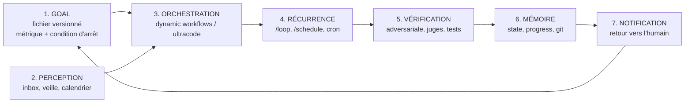

# Transformer Claude Code en machine autonome de production

**Dynamic workflows, loops et goals : ce qui est vérifié, ce qui est du folklore, et comment construire réellement la machine.**

*Version 1.1, 5 juin 2026. Méthode : deep research multi-agents (26 sources, 125 claims extraits, 25 vérifiés par votes adversariaux à 3 vérificateurs indépendants, 23 confirmés, 2 réfutés), complétée par une lecture directe des docs et blogs officiels le 5 juin, et par des retours de praticiens early adopters. Les dynamic workflows sont en research preview : noms, plafonds et keywords peuvent changer rapidement.*

---

## TL;DR

1. **Les dynamic workflows sont réels et officiels** : depuis le 28 mai 2026, Claude Code peut écrire à la volée son propre harness d'orchestration (un script JavaScript) qui pilote des dizaines à des centaines de subagents en arrière-plan, avec vérification adversariale avant de te rendre le résultat.
2. **ultracode n'est pas un outil, c'est un mode** : un réglage du menu `/effort` qui combine raisonnement maximal (xhigh) et déclenchement automatique de workflows sur chaque tâche substantielle.
3. **Boris Cherny (créateur de Claude Code) pousse un discours d'autonomie cohérent** : auto mode pour supprimer le babysitting des permissions, multi-clauding (5 à 10 instances en parallèle), `/loop` et `/schedule` pour la récurrence.
4. **`/goal` est une commande fantôme.** Une phrase unique dans le blog officiel de lancement, zéro documentation, invisible dans les builds que nous avons pu observer. Les roadmaps virales qui en font un pilier établi sur-vendent. Mais le concept de goal reste la clé de voûte : il se construit aujourd'hui en fichier, et ce guide montre comment.
5. **Le problème non résolu** : aucun pattern vérifié ne sait boucler sur de la production de contenu dont la qualité n'est pas vérifiable mécaniquement (un texte, un visuel, un dossier). C'est la vraie frontière, et la section 8 propose une approche pragmatique.

---

## 1. Ce qui vient de se passer

Le 28 mai 2026, Anthropic a sorti **Claude Opus 4.8** et, le même jour, les **dynamic workflows** de Claude Code en research preview ([annonce officielle](https://claude.com/blog/introducing-dynamic-workflows-in-claude-code), [page Opus 4.8](https://www.anthropic.com/news/claude-opus-4-8)). Disponibilité : CLI, Desktop et extension VS Code, sur tous les plans payants (Pro via `/config`, Max/Team par défaut, Enterprise via admin), ainsi que sur l'API Anthropic, Amazon Bedrock, Vertex AI et Microsoft Foundry. Il faut Claude Code v2.1.154 ou plus récent.

Le 2 juin, un second billet officiel a donné le framing conceptuel qui a mis le feu aux réseaux : ["A harness for every task"](https://claude.com/blog/a-harness-for-every-task-dynamic-workflows-in-claude-code). L'idée centrale, citée du billet : *"Claude can now write its own harness on the fly, custom-built for the task at hand."*

C'est cette phrase qui circule partout en ce moment, souvent déformée. Voici ce qu'elle veut dire exactement.

## 2. Dynamic workflows : Claude écrit son propre harness

Un **harness**, dans le jargon des agents, c'est la structure logicielle qui entoure le modèle : qui décide quoi lancer, dans quel ordre, comment vérifier, quand s'arrêter. Jusqu'ici, le harness était fixe (celui de Claude Code) ou écrit à la main par des développeurs. La nouveauté : Claude écrit lui-même un harness jetable, sur mesure pour ta tâche.

Concrètement, un dynamic workflow est ([docs officielles](https://code.claude.com/docs/en/workflows)) :

- **Un script JavaScript** que Claude rédige pour la tâche que tu décris, exécuté par un runtime **en arrière-plan, dans un environnement isolé**, pendant que ta session reste utilisable.
- Le script orchestre des subagents avec quelques fonctions spéciales : `agent()` lance un subagent, `parallel()` exécute des tâches en concurrence (avec barrière : il attend tout le monde), `pipeline()` fait passer des items à travers des étapes successives sans barrière (chaque item avance à son rythme).
- **Les résultats intermédiaires vivent dans les variables du script, pas dans la context window de Claude.** C'est le point architectural décisif : la machine peut brasser des volumes massifs sans saturer son propre contexte.
- Le script peut router chaque agent vers un modèle différent (Opus pour le raisonnement dur, Haiku pour l'exploration pas chère), et isoler chaque agent dans son propre git worktree.
- Chaque run écrit son script dans un fichier de ta session : tu peux le lire, le diff-er contre un run précédent, l'éditer et relancer. Un run interrompu est résumable dans la même session, les agents déjà terminés rendent leur résultat en cache.

### Qui tient le plan : la vraie différence avec les subagents et les skills

Le tableau des docs officielles est la meilleure boussole pour choisir son outil :

| | Subagents | Skills | Agent teams | **Workflows** |
|---|---|---|---|---|
| Qui décide de la suite | Claude, tour par tour | Claude, suivant le prompt | L'agent lead | **Le script** |
| Où vivent les résultats intermédiaires | Context window | Context window | Task list partagée | **Variables du script** |
| Échelle | Quelques tâches par tour | Idem | Quelques pairs longue durée | **Des dizaines à des centaines d'agents par run** |

La formule des docs : *"A workflow moves the plan into code."* Le plan sort de la tête de Claude pour entrer dans du code déterministe. C'est ce qui rend l'orchestration fiable ET rejouable.

### Les trois modes de défaillance que les workflows corrigent

Le billet de lancement nomme explicitement les trois pathologies du travail long en contexte unique :

1. **Agentic laziness** : Claude s'arrête avant d'avoir fini une tâche complexe multi-items et déclare le travail terminé après un progrès partiel (20 items traités sur 50, le reste "handled").
2. **Self-preferential bias** : Claude préfère ses propres résultats quand on lui demande de les vérifier ou de les juger. Un vérificateur juge et partie ne peut pas être un vérificateur honnête.
3. **Goal drift** : la perte graduelle de fidélité à l'objectif initial au fil des tours, surtout après compaction du contexte. Les contraintes "ne fais pas X" s'évaporent silencieusement au tour 47.

Un workflow corrige les trois structurellement : des Claudes séparés, des contextes isolés, des goals focalisés, et un programme déterministe qui garantit que chaque item de la liste est traité. Si ta tâche souffre d'un de ces trois symptômes, c'est le signal qu'il faut un workflow.

### L'échelle réelle (et la nuance que le marketing omet)

Le marketing dit "des centaines de subagents en parallèle". Les docs disent précisément : des dizaines à des centaines d'agents **par run**, avec un plafond de **16 agents simultanés** (moins sur les machines à peu de cœurs CPU) et **1 000 agents au total par run**. "Hundreds in parallel" décrit donc le total d'un run, pas le vrai parallélisme instantané. Deux autres limites structurantes : pas d'input utilisateur en cours de run (pour un sign-off entre étapes, découpe en plusieurs workflows), et le script lui-même n'a aucun accès direct au filesystem ou au shell, ce sont les agents qui lisent, écrivent et exécutent.

### La vérification adversariale intégrée

Avant que le résultat ne te remonte, **des agents indépendants relisent les conclusions les uns des autres de façon adversariale** ("independent agents adversarially review each other's findings before they're reported", docs officielles). C'est le mécanisme qui répond au self-preferential bias : un agent seul qui se relit lui-même confirme ses propres erreurs. Plusieurs agents payés pour se réfuter mutuellement, c'est structurellement plus fiable.

### Les six patterns officiels

Le billet de lancement nomme six formes d'orchestration. La grille de lecture : identifie le mode de défaillance dont souffre ta tâche, puis prends le pattern qui l'empêche structurellement.

| Pattern | Principe | Quand |
|---|---|---|
| **Classify-and-act** | Un classifieur décide du type de tâche, puis route vers les bons agents et le bon modèle | Travail hétérogène, dépenser Opus seulement où c'est dur |
| **Fan-out-and-synthesize** | Découper en N items, un agent par item en parallèle, puis fusionner | Liste énumérable d'items indépendants (50 fichiers, 200 sources) |
| **Adversarial verification** | Pour chaque agent producteur, un agent vérificateur séparé qui ne sait pas qui a produit l'artefact | Claims factuels, review, quality gates |
| **Generate-and-filter** | Générer beaucoup d'options, puis filtrer par rubrique et déduplication | Brainstorming, naming, design d'hypothèses |
| **Tournament** | N agents tentent la même tâche, jugement par paires jusqu'au vainqueur | Classement de goût, tri de gros volumes (le jugement comparatif bat la note absolue) |
| **Loop until done** | Boucler en spawnant des agents jusqu'à une condition d'arrêt | Volume de travail inconnu (chasse aux bugs, mining de patterns) |

Les vrais workflows en composent 2 à 4 : la deep research, par exemple, c'est fan-out (recherches parallèles) + adversarial verification (chaque claim vérifié indépendamment) + synthèse citée.

### Comment on l'invoque, comment on le garde

En langage naturel ("create a workflow that...", "use a workflow"), par le keyword `ultracode` (voir section 3), ou par une commande de workflow existante. Claude Code embarque un workflow bundled : **`/deep-research <question>`**, qui fan-out des recherches web, recoupe les sources, vote sur chaque claim et rend un rapport cité, claims non survivants déjà filtrés.

La gestion des runs passe par `/workflows` : voir les phases, le compte d'agents, les tokens par agent, pauser (`p`), stopper (`x`), relancer un agent (`r`). Et surtout **sauvegarder (`s`)** : le script du run devient une commande `/<nom>` réutilisable, stockée dans `.claude/workflows/` (projet, partagée via le repo) ou `~/.claude/workflows/` (perso, tous projets). Un workflow sauvegardé accepte des arguments (`args`) : tu peux lui passer une question, une liste de chemins, une config. Les early adopters vont plus loin et embarquent le fichier JavaScript du workflow **dans un skill**, référencé par le SKILL.md, en demandant à Claude de le traiter comme un template adaptable plutôt qu'un script à exécuter verbatim.

C'est le chaînon qui transforme la feature en machine : un workflow improvisé est une démo, un workflow sauvegardé et versionné est un actif de production.

## 3. ultracode : pas un outil, un mode

C'est la confusion la plus répandue en ce moment, donc clarifions avec les sources primaires :

| | Dynamic workflow | ultracode |
|---|---|---|
| Nature | L'outil d'orchestration (le script JS + son runtime) | Un **réglage** de Claude Code |
| Où | Se déclenche à la demande | Menu `/effort` |
| Effet | Exécute UNE orchestration | Fixe l'effort de raisonnement à xhigh ET laisse Claude décider seul de lancer des workflows, pour chaque tâche substantielle de la session |

Citation des docs : *"Ultracode is a Claude Code setting that combines xhigh reasoning effort with automatic workflow orchestration. With it on, Claude plans a workflow for each substantive task instead of waiting for you to ask."*

Les détails qui comptent à l'usage :

- Le mot-clé `ultracode` dans un prompt déclenche un workflow **ponctuel** sans changer le mode de la session. Claude Code surligne le keyword dans l'input ; `Option+W` (macOS) le neutralise pour ce prompt, et un toggle dans `/config` le désactive complètement.
- `/effort ultracode` vaut pour la session en cours et se réinitialise à la suivante. Une seule requête peut déclencher plusieurs workflows en chaîne : un pour comprendre, un pour modifier, un pour vérifier. Consommation de tokens en proportion.
- Le mode n'existe que sur les modèles qui supportent l'effort xhigh ; ailleurs, il n'apparaît pas dans le menu.
- Détail révélateur de la jeunesse de la feature : avant la v2.1.160, le mot-clé déclencheur s'appelait littéralement `workflow` (renommé depuis).

Donc : le workflow est le moteur, ultracode est le régulateur qui décide quand le moteur s'allume tout seul.

## 4. Ce que dit vraiment Boris Cherny

Boris Cherny a créé Claude Code chez Anthropic. Son discours public depuis mars 2026 est la source la plus citée (et la plus paraphrasée) du moment. Les faits vérifiés :

**Sur le babysitting** (post X du 16 avril 2026) : *"Auto mode = no more permission prompts."* Il décrit l'auto mode comme l'alternative plus sûre à `--dangerously-skip-permissions` pour les tâches longues et autonomes : deep research, refactoring, construction de features, itération jusqu'à atteindre un benchmark. Le billet d'ingénierie Anthropic du 25 mars 2026 ("How we built Claude Code auto mode") le confirme : l'auto mode est pensé comme *"a middle ground between manual review and no guardrails"*, destiné à remplacer le flag dangereux. Attention au caveat officiel : l'auto mode *"reduces prompts but does not guarantee safety"*. C'est une research preview, pas une garantie.

**Sur le parallélisme** (même thread) : *"This means no more babysitting while the model runs. More than that, it means you can run more Claudes in parallel. Once a Claude is cooking, you can switch focus to the next Claude."* La presse spécialisée rapporte qu'il fait tourner 5 à 10 instances un jour normal. C'est le pattern que la communauté appelle multi-clauding (le terme n'est pas de Cherny).

**Sur la récurrence** (post X du 29 mars 2026) : *"Two of the most powerful features in Claude Code: /loop and /schedule."* `/loop` prend un intervalle et une slash command et la ré-exécute (format `\d+[smhd]`, défaut 10 minutes). Ses exemples personnels : `/loop 5m /babysit`, `/loop 30m /slack-feedback`, `/loop 1h /pr-pruner`. Important : ces trois skills sont des **skills custom à lui**, pas des commandes built-in. Les tâches `/loop` expirent automatiquement au bout de 7 jours. `/schedule` est adossé aux Routines (sorties le 14 avril 2026) pour les tâches durables.

Méfiance en revanche sur les citations qui circulent sans source : le "I don't prompt Claude anymore. I write loops. My job is to write loops" placardé dans les threads viraux est un paraphrasage non sourcé de son tweet sur /loop, pas une citation vérifiée. L'idée est fidèle, les mots ne sont pas de lui.

La logique d'ensemble de Cherny tient en une phrase : supprimer les interruptions (auto mode), pour pouvoir paralléliser (multi-clauding), et planifier la récurrence (/loop, /schedule). Babysitting en moins, throughput en plus.

## 5. Les loops : du Ralph loop au /loop officiel

Avant les features officielles, la communauté avait inventé ses propres boucles. La plus célèbre : le **Ralph loop** de Geoffrey Huntley ([ghuntley.com/ralph](https://ghuntley.com/ralph/)). Dans sa forme la plus pure :

```bash
while :; do cat PROMPT.md | claude ; done
```

Les principes qui le font fonctionner (vérifiés sur les sources primaires) :

- **Une seule tâche par itération.** "You need to ask Ralph to do one thing per loop. Only one thing."
- **Contexte frais à chaque tour** : chaque itération est une instance neuve, la mémoire persiste via git history, un fichier `progress.txt` et un PRD structuré (`prd.json`).
- **Terminaison par condition vérifiable** : l'implémentation de référence ([snarktank/ralph](https://github.com/snarktank/ralph)) boucle jusqu'à ce que toutes les user stories du PRD soient `passes: true`. Chaque itération prend la story prioritaire, l'implémente, lance typecheck/lint/tests, ne commit que si ça passe, consigne ses learnings, et répond `COMPLETE` quand tout est vert (avec un plafond d'itérations de sécurité, environ 10).

### Ce que le créateur du Ralph loop dit lui-même (et que les threads viraux oublient)

C'est la partie la plus importante de toute la recherche. Huntley, l'inventeur et le plus bruyant avocat de la technique :

- *"There's no way in heck would I use Ralph in an existing code base."* Le pattern est fait pour du greenfield, pas pour du code existant.
- *"You'll get 90% done with it."* Plafond explicite : 90 %, pas 100 %.
- *"There is no way this is possible without senior expertise guiding Ralph."* Et : *"Anyone claiming that engineers are no longer required... is peddling horseshit."*
- *"You'll wake up to a broken codebase that doesn't compile from time to time."*

Thoughtworks classe la technique en "Trial", pas "Adopt". Le fameux cas d'auto-réparation autonome de bout en bout circule beaucoup, mais il est self-reported par Huntley lui-même, présenté comme "perhaps first", et nécessitait `--dangerously-skip-permissions`.

Conclusion honnête : les loops marchent, à condition d'accepter qu'ils produisent du 90 % supervisé, pas du 100 % autonome. Quiconque te vend l'inverse vend du rêve.

## 6. Le /goal fantôme (et pourquoi le goal reste la clé de voûte)

Voici l'état exact des preuves sur la commande `/goal`, parce que c'est le point où le discours ambiant déraille le plus :

- **Le billet officiel de lancement la mentionne exactement une fois** : *"pair them with /loop to be run at regular intervals, and /goal to set a hard completion requirement"*. Une phrase. C'est tout.
- **La documentation officielle ne la mentionne nulle part.** La page workflows, lue intégralement le 5 juin 2026, décrit `/workflows`, `/deep-research`, `/effort ultracode`, la sauvegarde, les args, les limites. Aucune trace de `/goal` : pas de syntaxe, pas d'exemple, pas de page.
- **Les builds observables ne l'exposent pas** : `/loop` est présent, `/goal` est introuvable.

Statut honnête : une commande **annoncée en une phrase et documentée nulle part**. Peut-être un rollout à venir, peut-être une phrase de blog en avance sur le produit. En attendant, les roadmaps virales "14 steps" qui enseignent `/goal` comme une brique établie, avec des exemples d'usage inventés, documentent un produit qui n'existe pas encore.

Note de méthode, parce qu'elle vaut la leçon : notre propre vérification adversariale initiale (3 vérificateurs indépendants) avait conclu "aucune mention de /goal dans les sources primaires", verdict 0-3. Une relecture humaine directe du billet a retrouvé la phrase unique. Même un harness de vérification multi-agents rate des détails ; c'est un argument de plus pour la règle "l'humain échantillonne en dernier ressort" (section 8).

### Le goal n'est pas une commande, c'est un fichier

Le concept de goal est exactement ce qui sépare les systèmes qui produisent de ceux qui tournent à vide, et tu n'as pas besoin d'attendre une commande pour l'avoir. La preuve est dans le Ralph loop : ce qui le fait terminer, ce n'est pas la boucle, c'est le **PRD**, un fichier de goal structuré avec une condition de complétion vérifiable par machine (`passes: true` pour chaque story). Huntley : *"you allocate the array with the required backing specifications and then give it a goal then looping the goal."* Et le troisième failure mode officiel des contextes longs s'appelle précisément goal drift : la perte de l'objectif au fil des tours.

> **Le goal est un fichier versionné** qui contient : l'objectif, la métrique de complétion, la deadline, et la condition d'arrêt. La loop le relit à chaque itération (contexte frais oblige), le workflow l'exécute, la vérification le mesure.

Sans ce fichier, une boucle autonome produit du mouvement, pas du progrès. Avec lui, chaque itération sait où elle en est et quand s'arrêter. Si `/goal` finit par shipper documenté, il se branchera exactement dans ce trou : une condition de complétion dure par-dessus les loops. L'architecture, elle, ne changera pas.

## 7. L'architecture complète d'une machine autonome

*Cette section est une synthèse de l'auteur, pas une spécification officielle. Elle assemble les briques vérifiées des sections précédentes en une architecture testée sur un système réel.*

Une machine autonome de production a sept organes. Les sept, pas cinq. L'erreur classique est d'optimiser les organes d'action et de laisser mourir les organes de perception et de sortie.



1. **Goal** : le fichier décrit en section 6. Daté, mesurable, avec condition d'arrêt. Revu à intervalle fixe (hebdomadaire), sinon il pourrit et la machine optimise des objectifs morts.
2. **Perception** : les yeux de la machine. Email, flux de veille, calendrier, état des projets. Si la perception casse (un token OAuth expiré, par exemple), la machine devient aveugle **silencieusement** : elle continue de tourner, mais sur des données mortes. Il faut surveiller la perception elle-même (un heartbeat qui vérifie que les capteurs répondent).
3. **Orchestration** : les dynamic workflows. C'est l'organe que tout le monde regarde en ce moment, et c'est légitime : c'est le bond en avant. Mais seul, il ne fait rien d'utile.
4. **Récurrence** : `/loop` pour la session (expire à 7 jours), `/schedule`/Routines pour le durable, cron/launchd pour l'infra. Le métronome.
5. **Vérification** : la relecture adversariale des workflows pour le factuel, les tests pour le code, et pour le créatif : voir section 8.
6. **Mémoire** : ce qui survit entre les itérations. Git history, fichiers de progrès, index mémoire, et désormais les **workflows sauvegardés** : l'orchestration elle-même devient un actif versionné. Règle apprise sur le terrain : si l'index mémoire dépasse la limite de chargement, il est tronqué silencieusement et la machine perd des souvenirs à chaque démarrage sans le dire. Surveiller la taille.
7. **Notification** : la sortie vers l'humain. Si le canal de notification est mort, la machine produit dans le vide. Tester le canal fait partie de la maintenance, au même titre que le reste.

**Le mode de défaillance dominant n'est pas l'action, c'est la boucle de perception.** Sur un système réel observé pendant des mois, les organes 3 et 4 (workflows, crons) tournaient parfaitement pendant que l'organe 2 était aveugle depuis 45 jours, l'organe 1 périmé depuis 3 mois, et l'organe 7 silencieusement mort. Résultat : une machine très occupée et parfaitement inutile. Vérifie tes sept organes avant d'ajouter le huitième.

### Et un huitième organe transversal : les garde-fous

- **Budget** : la critique substantielle la plus documentée contre les workflows n'est pas qu'ils ne marchent pas, c'est qu'ils brûlent des tokens (un run ambitieux peut coûter 5 à 10 fois ce que tu imaginais ; des cas de runs nocturnes à plusieurs millions de tokens circulent). Les parades officielles : tester le workflow sur une tranche réduite d'abord (un dossier, pas le repo ; une question étroite, pas un sujet), surveiller les tokens par agent dans `/workflows`, router les étapes faciles vers un modèle moins cher. Les parades communautaires : un budget explicite dans le prompt ("use 10k tokens").
- **Permissions** : auto mode plutôt que `--dangerously-skip-permissions`, et rappel du caveat officiel : ça réduit les prompts, ça ne garantit pas la sécurité. À savoir : les subagents d'un workflow tournent toujours en acceptEdits et héritent de ton allowlist ; les commandes hors allowlist peuvent prompter en plein run, donc prépare l'allowlist avant un run long.
- **Quarantaine des inputs non fiables** : tout workflow qui lit du contenu public ou tiers (tickets, feedback, pages scrapées) doit supposer qu'il peut contenir de l'injection de prompt. Le pattern : les agents qui lisent le contenu non fiable n'ont aucun privilège d'action ; des agents séparés, jamais exposés au contenu brut, font les actions.
- **Irréversibilité** : règle absolue, aucune action sortante (email, message, publication, paiement) sans confirmation humaine explicite. La machine prépare, l'humain envoie. C'est le seul garde-fou qui doit survivre à tous les modes autonomes.

## 8. Le problème ouvert : vérifier la qualité créative

Voici la limite que personne ne traite dans le discours actuel, et qui est pourtant LE sujet si tu veux produire du contenu plutôt que du code.

Tous les patterns vérifiés de ce guide reposent sur une condition de succès **vérifiable mécaniquement** : les tests passent, le typecheck passe, la story est `passes: true`. Le Ralph loop l'exige explicitement. Or un article, un dossier, un traitement, un visuel n'ont pas de suite de tests. "C'est bon" n'est pas calculable.

Approche pragmatique, par ordre de fiabilité décroissante :

1. **Décomposer le créatif en sous-critères mécaniques** quand c'est possible : longueur, structure attendue, présence des sections obligatoires, citations sourcées, zéro lien mort, conformité à une checklist de style. Ça ne mesure pas la qualité, ça élimine le déchet.
2. **LLM-as-judge avec rubrique explicite** : un agent juge note le livrable contre une grille écrite (critères, échelle, exemples de 1/5 et de 5/5). Un juge seul dérive ; la parade est le panel.
3. **Panel de juges adversarial** : plusieurs juges indépendants avec des angles différents (fond, forme, originalité, conformité au goal), votes agrégés, seuil de passage explicite (par exemple : médiane ≥ 4/5, aucun vote < 2). C'est la transposition au créatif de la relecture adversariale que les workflows font déjà pour le factuel. Règle d'appariement officielle : le juge ne doit connaître que la rubrique et l'artefact, jamais qui l'a produit. Et pour les choix de goût, préférer le **tournament** (jugement par paires) à la note absolue : c'est plus fiable.
4. **L'humain comme juge de dernier ressort, échantillonné** : tu ne relis pas tout, tu relis ce que le panel fait passer, et tu renvoies tes désaccords dans la rubrique. La rubrique devient ta voix qui s'affine à chaque itération.

La boucle créative complète ressemble alors à : goal file (avec rubrique) → workflow de production → panel de juges → si le score passe le seuil, livrer et notifier ; sinon, consigner les critiques dans le fichier de progrès et réitérer. C'est un Ralph loop dont les tests unitaires sont remplacés par un jury.

Soyons honnêtes sur le statut de cette approche : elle est expérimentale, non documentée officiellement, et le juge LLM a des biais connus (complaisance, préférence pour ses propres sorties, sensibilité à l'ordre). Le plafond de 90 % de Huntley s'applique doublement au créatif. Mais c'est aujourd'hui la seule voie praticable entre "tout relire soi-même" et "publier les yeux fermés", et la deuxième option est exclue.

## 9. Pas seulement pour le code : le playbook

Les premiers retours de praticiens hors développement confirment que la feature s'applique à tout corpus structuré : des early adopters l'utilisent déjà pour miner leurs propres sessions Claude Code (49 sessions analysées en parallèle pour en extraire les corrections récurrentes et les transformer en règles), pour analyser un mois de daily notes Obsidian (un agent Haiku par note, synthèse Opus par-dessus, chaque insight sourcé avec la date et le bullet point d'origine), ou pour extraire d'un corpus de transcripts des idées directement actionnables. Le pattern générique : **n'importe quel input (sessions, notes, vidéos, archives) → output structuré, sourcé, reproductible**. C'est exactement la définition d'une machine de production de contenu.

Cinq recettes :

**Recette 1, le brief du matin.** Une Routine quotidienne (`/schedule`) qui lit la perception (inbox, calendrier, veille), la croise avec le goal file, et te notifie un brief : ce qui a changé, ce qui bloque, la prochaine action recommandée. Coût faible, valeur immédiate, et ça force à maintenir la perception en vie.

**Recette 2, la veille qui écrit.** Un `/loop` (ou cron) qui scanne tes sources à intervalle régulier, détecte les sujets qui croisent ton goal file, et produit des drafts courts dans un dossier `drafts/`. Tu ne publies rien automatiquement : tu te réveilles avec des brouillons au lieu d'une liste de liens.

**Recette 3, l'usine à recherche.** Pour toute question de fond : `/deep-research`, le workflow bundled (fan-out de recherches, recoupement des sources, vote par claim, rapport cité avec les claims non survivants déjà filtrés). C'est le cas d'usage où la feature brille le plus, parce que la vérification factuelle EST mécanisable. Ce guide a été produit exactement comme ça.

**Recette 4, la boucle créative jugée.** Pour un livrable créatif récurrent : goal file avec rubrique, workflow de production, panel de juges (ou tournament pour les choix de goût), itération jusqu'au seuil ou au plafond d'itérations, puis revue humaine échantillonnée. Voir section 8 pour les limites.

**Recette 5, miner ses propres archives.** Périodiquement (mensuel), un workflow fan-out-and-synthesize sur tes propres traces : sessions, notes, brouillons, brainstorms. Objectif : extraire ce qui se répète (corrections récurrentes → candidates à devenir des règles ou des skills ; idées récurrentes → candidates à devenir des projets ; blocages récurrents → candidats à l'automatisation). La machine s'améliore en se lisant elle-même, et chaque insight doit citer sa source exacte (fichier, date) pour rester vérifiable.

Une fois qu'une recette marche : sauvegarde-la (`s` dans `/workflows`) et elle devient une commande. La version suivante du même travail coûte zéro improvisation.

## 10. Les dix règles

1. Le goal est un fichier versionné avec métrique et condition d'arrêt, revu chaque semaine. N'attends pas une commande `/goal` pour l'avoir.
2. Une tâche par itération de loop. Une seule.
3. Contexte frais à chaque itération ; la mémoire vit dans des fichiers et dans git, pas dans la context window.
4. Jamais de boucle sans condition de terminaison ET plafond d'itérations.
5. Surveille la perception et la notification autant que l'action : une machine aveugle ou muette qui tourne est pire qu'une machine arrêtée, parce qu'elle a l'air de marcher.
6. Budget explicite par run et par jour, et teste tout workflow sur une tranche réduite avant le run complet. Les workflows brûlent des tokens par construction (5 à 10 fois l'estimation naïve).
7. Auto mode plutôt que `--dangerously-skip-permissions`, quarantaine pour tout input non fiable, et aucune action sortante sans confirmation humaine.
8. Vérification adversariale pour le factuel, panel de juges ou tournament pour le créatif, humain échantillonné en dernier ressort. Le vérificateur ne doit jamais savoir qui a produit l'artefact.
9. Vise 90 % supervisé, pas 100 % autonome. Le créateur du pattern le plus radical du domaine ne promet pas mieux.
10. Chaque vérification manuelle que tu répètes est candidate à devenir un skill, chaque skill récurrent candidat à entrer dans un workflow, chaque workflow qui marche candidat à être sauvegardé en commande. C'est l'escalier de l'autonomie, et il se monte marche par marche.

## Sources

**Primaires (Anthropic)** : [Introducing dynamic workflows](https://claude.com/blog/introducing-dynamic-workflows-in-claude-code) · [A harness for every task](https://claude.com/blog/a-harness-for-every-task-dynamic-workflows-in-claude-code) · [Docs workflows](https://code.claude.com/docs/en/workflows) (lue intégralement le 5 juin 2026) · [What's new 2026-W22](https://code.claude.com/docs/en/whats-new/2026-w22) · [Claude Opus 4.8](https://www.anthropic.com/news/claude-opus-4-8) · [Docs scheduled tasks](https://code.claude.com/docs/en/scheduled-tasks) · Posts X de Boris Cherny ([16 avril](https://x.com/bcherny/status/2044847849662505288), [29 mars](https://x.com/bcherny/status/2038454341884154269)) · Blog ingénierie Anthropic, "How we built Claude Code auto mode" (25 mars 2026)

**Primaires (communauté)** : [ghuntley.com/ralph](https://ghuntley.com/ralph/) · [ghuntley.com/loop](https://ghuntley.com/loop/) · [snarktank/ralph](https://github.com/snarktank/ralph)

**Secondaires et critiques** : [InfoQ](https://www.infoq.com/news/2026/06/dynamic-workflows-claude-code/) · [Simon Willison sur Opus 4.8](https://simonwillison.net/2026/May/28/claude-opus-4-8/) · [Hacker News](https://news.ycombinator.com/item?id=47467922) · [ITNEXT, critique du Ralph loop](https://itnext.io/ralph-loop-is-innovative-i-wouldnt-use-it-for-anything-that-matters-cd92f2f0df2e) · Thoughtworks Tech Radar · Couvertures TechCrunch, The Register, alertes token burn (aiweekly, devtoolpicks) · Retours de praticiens early adopters (mining de sessions, daily notes Obsidian, NotebookLM ; X et Substack, juin 2026)

---

*Ce guide a été produit avec la méthode qu'il décrit : un dynamic workflow de deep research (109 agents, 26 sources, 25 claims vérifiés par votes adversariaux), complété par une lecture directe des sources primaires, puis rédaction et relecture humaine. En route, la vérification a tué des claims viraux, et la relecture humaine a corrigé la vérification elle-même (l'unique mention officielle de `/goal`, ratée par les trois vérificateurs). La machine a vérifié, l'humain a signé : dans cet ordre, et les deux.*

*Licence CC BY-NC-ND 4.0. Corrections et retours bienvenus via issues.*
